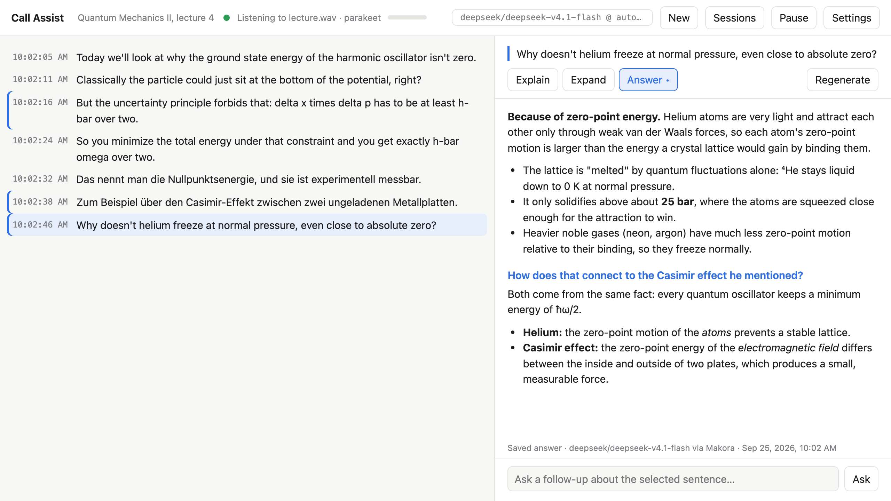
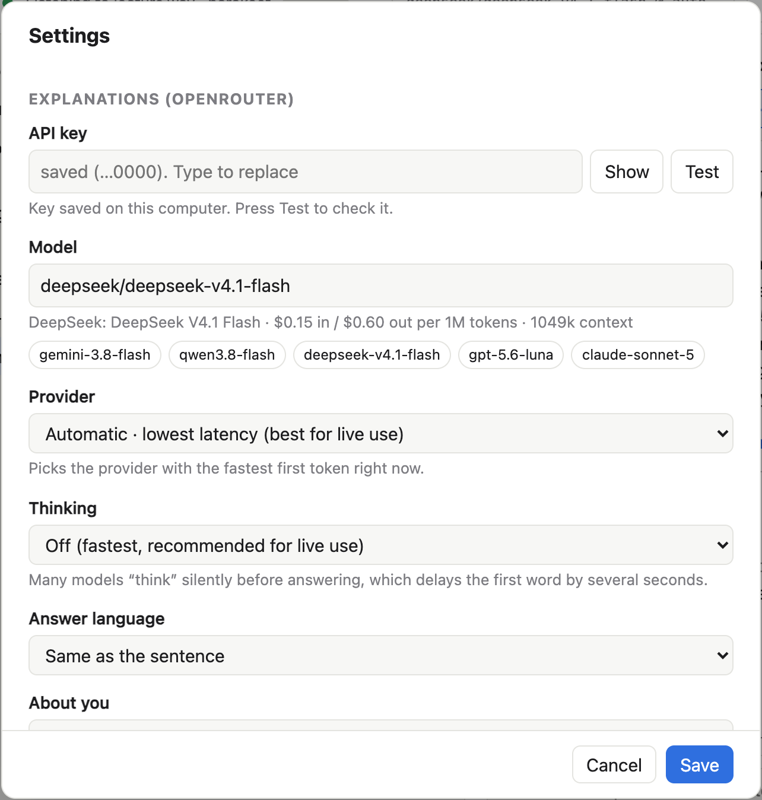

# Call Assist

Live, local transcription of **what your computer plays** (the other people in a call, a lecture, a video),
with one-click explanations from an LLM. Click any sentence and a model on [OpenRouter](https://openrouter.ai)
explains it, expands on it or answers it, streamed as it is written.



- **Private by default.** Speech recognition runs on your own computer, on the CPU. Nothing is sent anywhere
  until you click a sentence.
- **Fast.** Text appears while people speak. A finished sentence arrives about 0.5 s after the speaker pauses,
  and the first word of an explanation typically 0.4–1 s after you click.
- **English and German** (and 23 more European languages), detected automatically, even when mixed.
- **Remembers everything.** Transcripts and answers are autosaved. A sentence that was explained once is never
  paid for again.
- **Light.** No GPU, no PyTorch, no Node, no Docker. Python plus one speech library (`sherpa-onnx`).
- Runs on **Ubuntu** (PipeWire/PulseAudio) and **macOS 14.2+**.

---

## Contents

1. [Installation](#installation)
2. [First start](#first-start)
3. [Using it during a call](#using-it-during-a-call)
4. [Sessions and saved answers](#sessions-and-saved-answers)
5. [Settings](#settings)
6. [Choosing a speech model](#choosing-a-speech-model)
7. [Making answers faster](#making-answers-faster)
8. [Troubleshooting](#troubleshooting)
9. [Privacy: what leaves your computer](#privacy-what-leaves-your-computer)
10. [How it works](#how-it-works)
11. [Development](#development)

---

## Installation

You need Python 3.12 (installed automatically by `uv`) and about 1 GB of disk space for the default speech model.

**1. System packages**

```bash
# Ubuntu
sudo apt install pulseaudio-utils ffmpeg   # parec records system audio (usually already installed);
                                           # ffmpeg is only needed to replay/benchmark mp3 and similar files
# macOS
xcode-select --install                     # Swift compiler, used once to build the small audio helper
```

**2. Get the code and dependencies**

```bash
git clone https://github.com/Eritar/asr_researcher.git
cd asr_researcher
curl -LsSf https://astral.sh/uv/install.sh | sh     # skip if you already have uv
uv sync
```

**3. Download a speech model**

```bash
scripts/download_models.sh parakeet        # ~460 MB, recommended default
# optional extras: scripts/download_models.sh qwen3 cohere canary
```

**4. Get an OpenRouter API key** at [openrouter.ai/keys](https://openrouter.ai/keys) and add a few dollars of credit.
Explanations with a fast model cost a fraction of a cent each.

## First start

```bash
uv run python -m app.main
```

Open **http://127.0.0.1:8765** in your browser, then click **Settings** (top right):



1. **API key**: paste your OpenRouter key and press **Test**. It shows whether the key works and how much
   credit is left.
2. **Model**: keep the default or pick one of the suggestions. `deepseek/deepseek-v4.1-flash` and
   `google/gemini-3.8-flash` are fast and good at science. The line under the field shows price and context size.
3. **Provider**: leave it on **Automatic · lowest latency**.
4. **Thinking**: leave it **Off** for live use (see [Making answers faster](#making-answers-faster)).
5. **About you**: optional, e.g. *"Chemist; skip basic chemistry, explain physics in more detail."*
   Answers are pitched at that level.
6. **Listen to**: what to transcribe.
   - *All system audio*: everything you hear.
   - macOS: *Only Microsoft Teams / Zoom / Firefox…*, so music and notification sounds stay out of the transcript.
     An app appears in the list once it has played audio.
   - Ubuntu: a specific output device, useful when the call runs on a headset that isn't your default output.
7. **Save**.

**macOS only:** the first time, macOS asks whether your terminal (Terminal, iTerm, VS Code…) may record system
audio. Allow it. If you missed the prompt, enable it under *System Settings → Privacy & Security → Screen & System
Audio Recording*, then press **Retry** in the app.

The dot in the header turns green (*Listening to …*) and the small bar next to it shows the input level.
Play something with speech to check that text appears.

## Using it during a call

| What | How |
|---|---|
| Live text | Grey italic text is the sentence being spoken. It turns into a normal line when the speaker pauses. |
| Explain a sentence | Click it. The answer streams into the right-hand panel. |
| Other kinds of help | **Explain** (meaning, terms), **Expand** (background, context), **Answer** (the sentence is a question). Keys `1`, `2`, `3`. |
| Ask more | Type in the box at the bottom (*"And in English?"*, *"Give an example"*). The model sees the sentence, the answer so far and the recent transcript. |
| Stop an answer | **Stop** or `Esc` |
| Get a fresh answer | **Regenerate** (replaces the saved one) |
| Pause transcription | **Pause** / **Resume**. Nothing is recorded while paused. |
| Start over | **New** starts a new session. The current one stays saved. |

Hints:

- A blue bar on the left of a line means it has saved answers. A dot on a mode button (`Answer •`) means
  that mode has a saved answer for the selected sentence.
- Clicking another sentence while an answer is still being written does not cancel it. It finishes in the
  background and is saved.
- Each answer is based on the clicked sentence **plus the 20 sentences before it**, so *"what does he mean by that?"*
  style questions work.
- Hover over a line to see how long its recognition took.

## Sessions and saved answers

Everything is saved the moment it exists. Nothing is lost if the app or the computer crashes.

- One file per session: `~/.local/share/call-assist/sessions/<date>_<time>.jsonl` (the folder can be changed in
  Settings → *Save sessions in*).
- **Answers are generated once** per sentence and mode. Clicking the sentence again shows the saved answer
  instantly, with no request and no cost. Follow-up questions are saved with it.
- **Sessions** (header) lists all sessions. From there you can:
  - **Open** one to read it again or to continue it live (new sentences are appended),
  - **Rename** the current one (e.g. *"Quantum Mechanics II, lecture 4"*). You can also click its name in the header,
  - **Export .md**: a readable document with every sentence, timestamps and the answers quoted underneath,
  - **Raw .jsonl**: the file itself,
  - **Delete** (click twice to confirm).

The `.jsonl` format is one JSON object per line: a `meta` record (id, title, creation time), `utt` records (one per
sentence) and `answer` records (the full question/answer thread for a sentence and mode; the latest one wins).
It is easy to process with any script.

## Settings

Everything can be changed in the web UI. The UI saves to `~/.config/call-assist/settings.json` (readable only by
you), which takes precedence over environment variables / a `.env` file. Those are optional and useful for
headless setups (see `.env.example`).

| Setting (UI) | Environment variable | Default | Meaning |
|---|---|---|---|
| API key | `OPENROUTER_API_KEY` | – | Your OpenRouter key |
| Model | `OPENROUTER_MODEL` | `google/gemini-3.8-flash` | Any OpenRouter model id |
| Provider | `OPENROUTER_PROVIDER`, `OPENROUTER_SORT` | automatic, lowest latency | Pin one provider endpoint (e.g. `deepinfra/fp8`) or let OpenRouter pick by `latency`, `throughput` or `price` |
| Fallback | `OPENROUTER_FALLBACKS` | on | When a pinned provider fails, try others |
| Thinking | `OPENROUTER_REASONING` | `off` | `off`, `low` or `on` (model default) |
| Answer language | `ANSWER_LANGUAGE` | same as the sentence | Or always `en` / `de` |
| About you | `ABOUT_ME` | – | Your background, sent with each question |
| Listen to | `AUDIO_SOURCE` | `system` | `system`, `app:<bundle id>` (macOS), `pulse:<source>` (Linux), `file:<path>` |
| Speech model | `ASR_ENGINE` | `parakeet` | `parakeet`, `qwen3`, `cohere`, `canary` |
| Spoken language | `LANGUAGE` | auto | Required (`en`/`de`) for `cohere` and `canary` |
| Pause that ends a sentence | `VAD_MIN_SILENCE_S` | `0.35` s | Shorter means faster lines but more splitting |
| Glossary | file `glossary.txt` | – | Technical terms, one per line (used by `qwen3`) |
| Save sessions in | `SESSIONS_DIR` | `~/.local/share/call-assist/sessions` | Where sessions are autosaved |
| – | `HOST`, `PORT` | `127.0.0.1`, `8765` | Web server address |
| – | `NUM_THREADS` | up to 8 | CPU threads for speech recognition |

## Choosing a speech model

All models run on the CPU through ONNX Runtime. Download with `scripts/download_models.sh <name>` and switch in
Settings → *Speech model*.

| Model | Size | Speed (M1 Pro) | Notes |
|---|---|---|---|
| `parakeet` (NVIDIA Parakeet TDT v3) | 0.6B | ~3% of real time | **Default.** Fast, very accurate, detects English/German automatically. Cannot use the glossary. |
| `qwen3` (Qwen3-ASR) | 0.6B | ~13% of real time | Uses your **glossary** to get rare technical terms and names right. |
| `cohere` (Cohere Transcribe) | 2B | slower | Best accuracy on public benchmarks; one fixed language per session. |
| `canary` (NVIDIA Canary flash) | 180M | very fast | For weak computers; one fixed language. |

Public benchmarks say little about *your* audio (accents, microphones, jargon). To measure it, record a few minutes
of typical speech, type the exact transcript, put the pairs into `samples/` as `talk1.wav` + `talk1.txt`, and run:

```bash
uv run python bench.py --data samples --engines parakeet qwen3 -v
```

It prints the word error rate (lower is better) and speed of each model, plus every transcript with `-v`.

## Making answers faster

Measured from a click to the first word of the answer:

| Setup | First word |
|---|---|
| Thinking on, one slow provider pinned | 3–9 s |
| Thinking off, same provider | ~0.9 s |
| **Thinking off, Automatic · lowest latency** | **0.35–1 s** |

- **Thinking** is the biggest factor. Many "flash" models reason silently before writing anything. The answer
  footer shows *thinking…* while that happens. Some models (e.g. Gemini Flash) cannot turn it off. The app then
  automatically asks for minimal thinking.
- **Provider**: the same model can be much faster at one provider than another. The answer footer shows who
  replied (*via Makora · first token 380 ms*).
- The app keeps its connection to OpenRouter open, so a click doesn't pay for a new connection.
- A local LLM would not be faster on a laptop (a similar ~0.3–0.5 s to the first word) and gives noticeably weaker
  explanations of scientific material.

On the transcription side, lowering *Pause that ends a sentence* (Settings) makes lines appear sooner.

## Troubleshooting

| Problem | Fix |
|---|---|
| Level meter stays empty while audio plays (macOS) | Allow *System Audio Recording* for your terminal app in *System Settings → Privacy & Security*, then **Retry**. |
| "parec stopped: Connection refused" (Linux) | The sound server isn't reachable: `systemctl --user status pipewire-pulse`. |
| Nothing transcribed on Linux although audio plays | Settings → *Listen to*: pick the output device the call actually plays on. |
| *"waiting for … to use audio"* (macOS) | The chosen app isn't playing sound yet. It starts automatically once it does. |
| Answers fail with `401` | Wrong or missing key: Settings → API key → **Test**. |
| Answers take many seconds | Thinking off, Provider *Automatic · lowest latency* (see above). |
| "Reasoning is mandatory" | Handled automatically. If you see it anyway, choose Thinking *Low*. |
| A speech model is greyed out in Settings | Not downloaded: `scripts/download_models.sh <name>`. |
| Technical terms are misrecognised | Add them to the glossary and use the `qwen3` model. The LLM is also told to correct obvious recognition errors. |
| "address already in use" | Another copy is running, or start on another port: `PORT=8770 uv run python -m app.main`. |
| Two people speaking at once come out as one garbled line | A known limitation: none of the models separate overlapping speakers. |

Server messages are printed in the terminal where you started the app.

## Privacy: what leaves your computer

- **Audio never leaves your computer.** Recognition is local. Your microphone is never recorded, only what
  your computer plays.
- **When you click a sentence**, that sentence, up to 20 preceding sentences, your "About you" text and any
  follow-up question are sent to OpenRouter and the chosen model provider. Nothing is sent without a click.
- The API key is stored in `~/.config/call-assist/settings.json` with permissions `600`.
- The web server only listens on `127.0.0.1` and rejects requests from other websites, so a page you visit
  can't read your transcript or use your key.

## How it works

```
system audio ─► parec (Linux) / systap Core Audio tap (macOS)     16 kHz mono
            ─► Silero VAD: cuts speech into sentences
            ─► speech model (sherpa-onnx, CPU): re-reads the current sentence every 0.3 s for live text,
               then once more when the speaker pauses
            ─► FastAPI + WebSocket ─► browser
click ─► OpenRouter (streaming) ─► browser, and appended to the session file
```

If the CPU can't keep up, outdated live-text updates are skipped, so the transcript never falls behind.

## Development

```bash
uv run pytest            # unit tests
uv run python -m app.main
```

```
app/main.py           web server, WebSocket, settings/sessions API
app/pipeline.py       capture thread + recognition thread
app/audio.py          audio sources: parec, macOS tap, files
app/native/systap.swift   macOS system-audio helper (compiled automatically into build/)
app/segmenter.py      voice activity detection -> sentences
app/engines.py        speech models
app/llm.py            OpenRouter streaming, prompts, provider routing
app/sessions.py       autosaved sessions, Markdown export
app/settings.py       settings stored from the UI
app/static/index.html the whole UI (plain HTML/JS, no build step)
bench.py              word error rate / speed on your own recordings
scripts/download_models.sh
```

### Model licenses

The speech models are downloaded separately and keep their own licenses:
Parakeet TDT v3 and Canary: CC-BY-4.0 (NVIDIA) · Qwen3-ASR: Apache-2.0 · Cohere Transcribe: Apache-2.0 ·
Silero VAD: MIT. Converted ONNX versions are from the [sherpa-onnx](https://github.com/k2-fsa/sherpa-onnx) project.
